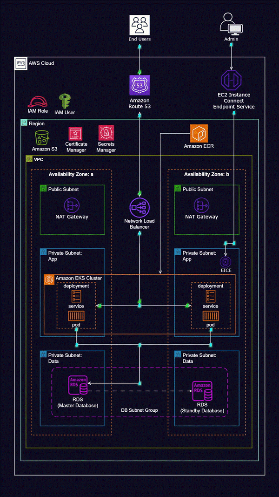

# Dynamic Web App Deployment with Kubernetes on AWS EKS

---

## Overview

This project demonstrates how to deploy a dynamic web application on AWS using Kubernetes and EKS (Elastic Kubernetes Service). The deployment process involves multiple steps, including setting up the networking environment, containerizing the application with Docker, configuring EKS for Kubernetes orchestration, and ensuring secure access to AWS resources. The application is connected to an RDS database and uses several AWS services for security, scalability, and monitoring.

### Repository Contents
- **Reference Diagram**: A visual representation of the architecture used for deploying the application.
- **Scripts**: All the scripts and configuration files used to automate the deployment process.
- **Kubernetes Manifests**: YAML files used to deploy the application on EKS.
- **Dockerfile**: The Dockerfile used to containerize the application.

---

## Steps Involved

### 1. Set up Git and GitHub
- Initialized a Git repository to store all project files and scripts.
- Pushed the repository to GitHub for version control and collaboration.

---

### 2. Create AWS VPC with Networking Components
- **VPC**: Created a Virtual Private Cloud to securely host all resources.
  

- **Internet Gateway**: Set up an internet gateway to enable public internet access.
  

- **Subnets**: Configured public and private subnets for better isolation of resources.
  

- **Route Tables**: Defined proper routing to ensure correct traffic flow between public and private subnets.
  

- **NAT Gateway**: Enabled outbound internet access from private subnets.
  

- **Security Groups**: Configured security groups to control access to EC2 and RDS instances.
  

- **EC2 Instance Connect Endpoint**: Allowed secure access to EC2 instances without direct SSH access.
  

- **RDS Instance**: Provisioned an RDS instance (e.g., MySQL, PostgreSQL) for database storage.
  

--- 
### 3. Create Dockerfile
- Created a Dockerfile to containerize the web application, ensuring all dependencies are packaged within the container.
### 4. Build Docker Image
- Built the Docker image using the Dockerfile with the `docker build` command.
- Tested the image locally to ensure it functions as expected.

   

---
### 5. Push Docker Image to AWS ECR
- Created an ECR (Elastic Container Registry) repository to store Docker images.
- Pushed the built Docker image to ECR using the AWS CLI.
  

---
### 6. Create IAM Roles with S3 Access
- Created IAM roles that grant the necessary permissions for accessing AWS resources like S3, which is used for storing static assets.
  

---
### 7. Migrate Data into RDS Using Flyway
- Utilized **Flyway** for database migration to ensure the RDS instance has the correct schema before application deployment.
- Configured Flyway scripts to automate schema versioning.
  

---
### 8. Install Command-Line Tools
- Installed essential command-line tools to interact with AWS and Kubernetes:
  - **kubectl**: For managing Kubernetes clusters.
  - **eksctl**: For managing AWS EKS clusters.
  - **helm**: For managing Kubernetes applications and deploying Helm charts.

---

### 9. Store Secrets in AWS Secrets Manager
- Stored sensitive application data (e.g., database credentials, API keys) in **AWS Secrets Manager**.
- Configured the Kubernetes deployment to retrieve secrets from Secrets Manager securely

---
### 10. Create Kubernetes Cluster with Control Plane and Worker Nodes
- Used **eksctl** to create a Kubernetes cluster on AWS EKS, which included the control plane and worker nodes.
- The worker nodes were automatically managed and scaled based on the configuration.
  

---
### 11. Create IAM Roles for EKS and Worker Nodes
- Defined IAM roles for the EKS control plane and worker nodes to ensure secure access to AWS resources (e.g., EC2, S3, RDS).
  

---
### 12. Create Kubernetes Manifest Files
- Created Kubernetes YAML files for deploying the application:
  - **Deployment**: Defined the application's container, replicas, and environment variables.
    

 - **Service**: Exposed the application to the network and connected it to a Load Balancer.
   

   - **ConfigMap**: Provided non-sensitive configuration data to the application.
  - **Secrets**: Managed sensitive data securely in the deployment.

---
### 13. Deploy to EKS Cluster
- Applied the Kubernetes manifests using `kubectl apply` to deploy the application to the EKS cluster.
- Verified the application was running using `kubectl get pods` and `kubectl get services`.
  

---
### 14. Set up DNS with Route 53
- Configured **Route 53** for DNS routing, pointing the domain to the public load balancer that exposes the application to the internet.

---

### Conclusion
By leveraging AWS EKS, Docker, Kubernetes, and other AWS managed services, this project provides a highly scalable, secure, and cost-efficient solution for hosting a dynamic web application. The use of Kubernetes enables automated deployments, scaling, and management of the application, while AWS services like RDS and S3 ensure that the application's data is stored reliably and securely.

This setup improves application availability, and automates many aspects of the infrastructure, making it easier to manage and scale as traffic increases. By integrating AWS Secrets Manager, IAM roles, and security best practices, the application is also secure and adheres to industry standards for cloud-native applications.

